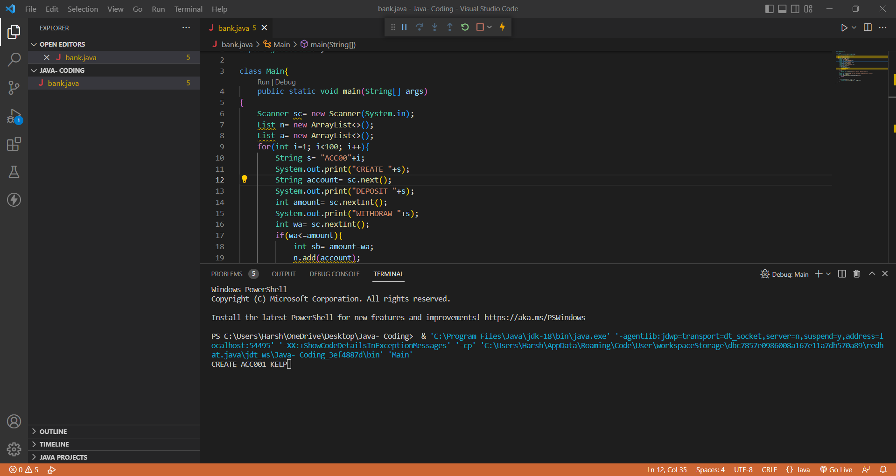

# JavaProgram
This is a CLI App performing tasks- Creation of Account, Deposit of Amount in created Account, Withdrwaing of Amount from created Account and showing Final Balance of created Accounts. 

First, User have to give a name for Creation of Account as shown in below Screenshot:

Then, User will be able to deposit some amount in the created account as shown below:
 

Here, Account is created with some deposited amount as per command given from User-end.
Now, Withdrawing of Amount will be available for User for withdrwaing of balance, if User inputs amount more than deposited amount, an error come "Inavalid Amount". If, user give sufficient amount for withdrawn as shown below it will not give any error and that amount will be deducted from deposited balance.

Now after these operations, User ia asked whether he/she will be interested in creation of other of Other Account or not?
If user inputs "n or N", The operation will break and shows the account name with current availabla balance.
Or if user selects "y or Y", Same operations will be performed for this new Account according to user needs as before.

After successfully inputting the details of second account as shown below, now user had created new account with new details stored in it. Now, as mentioned earlier, by selecting "y" will create another new account. If we want to break the operation, we select "n" insted of "y" as shown below:
 

After selecting "NO", the user will be able to see remaining final balances of said accounts after performing all the operations successfully. Same is shown below:

THANKYOU !!!